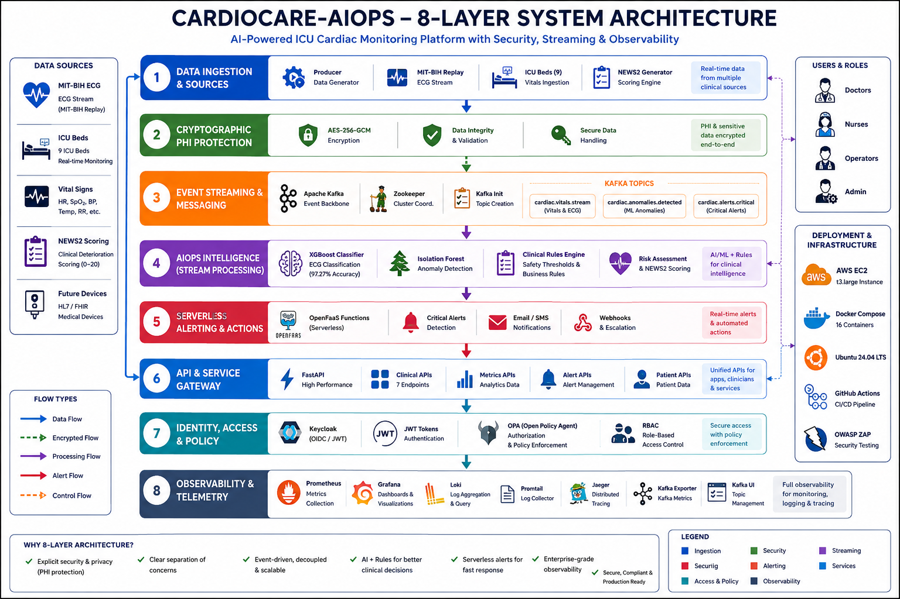

# CardioCare-AIOps — Architecture Documentation

**Author:** Muhammad Raees (raees.malik89@gmail.com)
**Topic:** Topic 7 — Designing Serverless Architectures with Event-Driven AIOps, Observability, and Security Integration

---

## 1. System-Level Architecture Diagram

The diagram below shows all components of the CardioCare-AIOps platform and how they interact. I have organised the system into **eight horizontal layers** so the separation of concerns is explicit. Data flows from top to bottom, while the security (encryption, identity) and observability concerns wrap the whole stack.



The same 16 Docker containers, deployed on a single AWS EC2 host via Docker Compose, are grouped into these eight layers:

**Layer 1 — Data Ingestion & Sources.** The producer service replays real MIT-BIH ECG beats as a live stream across 9 simulated ICU beds at one event per second, together with vital signs (HR, SpO₂, BP, temperature, respiration). A NEWS2 generator computes an early-warning deterioration score (0–20) per reading. In production this layer is replaced by IoT / HL7 FHIR device connectors.

**Layer 2 — Cryptographic / PHI Protection.** Every payload is encrypted with AES-256-GCM at the application layer before it leaves the producer, with GCM authentication-tag integrity validation and secure key handling. Protected health information (PHI) is encrypted end-to-end — only ciphertext travels on the network and is stored in Kafka. This satisfies the HIPAA §164.312 encryption-in-transit safeguard.

**Layer 3 — Event Streaming & Messaging.** Apache Kafka is the event backbone, coordinated by Zookeeper, with `kafka-init` bootstrapping the topics. Three topics decouple producers from consumers: `cardiac.vitals.stream` (3 partitions — raw vitals & ECG), `cardiac.anomalies.detected` (3 partitions — ML-flagged anomalies) and `cardiac.alerts.critical` (1 partition — critical alerts, strict ordering). Decoupling lets new beds or consumers be added with no downstream change and supports horizontal scale.

**Layer 4 — AIOps Intelligence (Stream Processing).** The intelligence tier. It decrypts each event inside the trusted service boundary and runs a hybrid detector: **XGBoost** classifies each ECG beat into 5 AAMI classes (97.27% offline test accuracy, AUC-ROC 0.9927), **IsolationForest** flags statistical outliers in the 7-feature vitals vector unsupervised (auto-retrained on a sliding buffer every 5 minutes), and a **Clinical Rules engine** applies hard safety thresholds (SpO₂<85, HR>180/<35, SBP>185/<75) that override the models. It emits a risk assessment plus NEWS2 score and publishes anomaly/alert events. Exposes Prometheus `/metrics` on port 8001.

**Layer 5 — Serverless Alerting & Actions.** OpenFaaS (faasd) functions fire only on critical alerts — scale-to-zero, so there is no idle cost. Triggered by `cardiac.alerts.critical` (event-driven), the stateless handler dispatches notifications (email / SMS) and webhooks for escalation (Slack / PagerDuty). Also callable via an OpenFaaS-compatible HTTP endpoint.

**Layer 6 — API & Service Gateway.** A FastAPI high-performance gateway exposes 7 endpoints — clinical, metrics/analytics, alert-management and patient APIs — giving applications, clinicians and downstream services one unified, OpenTelemetry-traced access point. Traces are exported to Jaeger.

**Layer 7 — Identity, Access & Policy.** Keycloak issues OIDC/JWT tokens for authentication; the JWT is validated on every request; OPA (Open Policy Agent) enforces authorization with default-deny RBAC across the clinical roles (cardiologist, doctor, nurse, analyst). The chain is **fail-closed** — if a security component is unavailable, the API denies access (returns 503) rather than allowing it.

**Layer 8 — Observability & Telemetry.** Full-stack monitoring: Prometheus (metrics, port 9091 on host), Grafana (5 live dashboards), Loki + Promtail (centralised log aggregation), Jaeger (distributed tracing via OpenTelemetry), plus Kafka Exporter (Kafka metrics) and Kafka UI (topic management). Observability is privacy-conscious — logs and metrics are keyed on `bed_number`, never on patient identity.

> **Why eight layers?** Explicit security and PHI protection, a clear separation of concerns, an event-driven and decoupled core, AI + clinical rules for safer decisions, serverless alerting for fast response, and enterprise-grade observability. The eight-layer view is the same system as the earlier five-layer summary, drawn at a finer granularity — every layer maps to real, running containers.

> **Infrastructure:** AWS EC2 (t3.large), Docker Compose (16 containers), Ubuntu 26.04 LTS, GitHub Actions CI/CD, OWASP ZAP security testing.

---

## 2. Network Flow Diagram

This diagram traces how a single cardiac event travels across the network from the moment it is produced to the moment a clinical alert is raised.

```
[Patient Device / Simulator]
        │
        │  JSON over TCP (Kafka producer protocol)
        ▼
[Producer Container] ──► [Kafka Broker :29092]
                                │
                         Topic: cardiac.vitals.stream
                         Partition: hash(patient_id) % 3
                                │
                         Consumer Group: cardiocare-aiops-engine
                                │
                         ┌──────▼──────────────────────────────────┐
                         │  AIOps Engine                           │
                         │  score = model.decision_function(x)[0]  │
                         │  if score < threshold:                  │
                         │      classify_severity(vitals, score)   │
                         └──────┬──────────────────────────────────┘
                                │                    │
                    score ≥ 0   │                    │  score < threshold
                    (normal)    │                    ▼
                    discard ◄───┘        Topic: cardiac.anomalies.detected
                                                     │
                                         severity == CRITICAL only
                                                     │
                                                     ▼
                                         Topic: cardiac.alerts.critical
                                                     │
                                         Consumer Group: cardiocare-alert-function
                                                     │
                                                     ▼
                                         [Alert Function Container]
                                           HTTP POST to webhook (optional)
                                           Write to in-memory alert log
                                           Log line picked up by Promtail → Loki
                                                     │
                                                     ▼
                                         [Nurse Station Dashboard / Grafana]
```

---

## 3. Data Flow Diagram

This diagram shows how data is structured and transformed at each stage.

```
STAGE 1 — RAW SENSOR EVENT
──────────────────────────
{
  "event_id":   "PT-004-00000034",
  "patient_id": "PT-004",
  "timestamp":  "2026-06-09T10:23:35Z",
  "vitals": {
    "heart_rate":       187.0,     ← FEATURE 1
    "systolic_bp":      192.0,     ← FEATURE 2
    "diastolic_bp":     110.0,     ← FEATURE 3
    "spo2":              79.0,     ← FEATURE 4
    "ecg_amplitude":      2.8,     ← FEATURE 5
    "temperature":       38.9,     ← FEATURE 6
    "respiratory_rate":  34.0      ← FEATURE 7
  },
  "ecg_sample": 0.9421,
  "ward": "ICU",
  "device_id": "DEVICE-PT-004"
}

         │
         ▼  Feature extraction + IsolationForest scoring

STAGE 2 — ANOMALY EVENT
────────────────────────
{
  "event_id":     "PT-004-00000034",
  "patient_id":   "PT-004",
  "timestamp":    "2026-06-09T10:23:35Z",
  "anomaly_score": -0.7821,             ← Isolation Forest decision score
  "severity":     "CRITICAL",           ← Classified: score < -0.5 + clinical rules
  "vitals":       { ...same as above... },
  "model":        "IsolationForest",
  "features_used": ["heart_rate", "systolic_bp", "diastolic_bp", "spo2",
                    "ecg_amplitude", "temperature", "respiratory_rate"]
}

         │  severity == CRITICAL
         ▼

STAGE 3 — CRITICAL ALERT (triggers serverless function)
────────────────────────────────────────────────────────
{
  ...all anomaly fields above...,
  "alert_type":       "CARDIAC_EMERGENCY",
  "action_required":  "IMMEDIATE_CLINICAL_REVIEW",
  "triggered_function": "alert-handler-v1"
}

         │
         ▼  handle_alert() executes

STAGE 4 — FUNCTION RESPONSE
────────────────────────────
{
  "function":   "cardiocare-alert-handler-v1",
  "status":     "executed",
  "notification": {
    "type":       "CARDIAC_EMERGENCY",
    "message":    "CARDIAC ALERT: Patient PT-004 in ICU. HR=187, SpO2=79%, BP=192/110",
    "escalation": "CALL_CODE_BLUE",
    "iso27001_ref": "A.16.1.5"
  },
  "actions_taken": ["alert_logged", "nurse_station_notified", "ehr_flagged"]
}
```

---

## 4. Key Design Decisions

### Why Kafka Instead of RabbitMQ or NATS

Kafka was chosen over RabbitMQ and NATS because it provides a durable, replayable log.  In a clinical context this is important: if the AIOps engine restarts (e.g. model retraining), it can replay events from its last committed offset rather than losing data.  RabbitMQ deletes messages after delivery; NATS JetStream would be a valid alternative but adds Kubernetes dependency.

### Why Isolation Forest Instead of a Rule-Based System

A threshold rule such as "alert if HR > 150" ignores the clinical context.  A patient in post-operative recovery may have normal HR of 140; the same value in a resting ICU patient is alarming.  Isolation Forest captures multivariate normality — it alerts when the *combination* of features is unusual, not just a single value.  The model updates automatically as more real observations arrive, adapting to individual patient baselines.

### Why a Separate Alert Function Container

The alert function runs in its own container instead of inside the AIOps engine. This keeps it independent and easier to manage. It can also be moved to other serverless platforms such as OpenFaaS, Knative, AWS Lambda, Azure Functions, or Google Cloud Functions without changing the code. Only the event trigger needs to be changed.

### Why OpenFaaS (faasd) Instead of Knative

Knative requires a full Kubernetes cluster, which is too complex for a single EC2 academic project. This project uses **faasd**, which runs directly on Docker and provides the main serverless features — deploying functions, HTTP/event triggers, and scaling idle functions to zero. It is lightweight, easy to manage, and a better fit for this prototype.

### Why XGBoost Instead of Deep Learning for ECG Classification

XGBoost was chosen because it is fast, accurate, and works well on a CPU without needing a GPU. It achieved **97.27% accuracy** while keeping the response time low. A deep learning model would require more computing power and add unnecessary complexity for this project.

### Why OPA Instead of Hardcoded Python Authorization

OPA keeps the access rules separate from the application code. This makes security policies easier to update without changing or redeploying the API. It also keeps all authorization rules in one central place, making them easier to manage and audit.


---

## 5. Standards Alignment

> **Alignment, not certified compliance.** The table below maps design choices to the
> *principles* of each standard for academic purposes. No certifying audit, formal risk
> assessment or GDPR DPIA has been performed. See [Scope & Limitations](LIMITATIONS.md).
> HIPAA is referenced only because the technical safeguards were designed using HIPAA 45
> CFR §164.312 principles — the MIT-BIH dataset is de-identified public research data to
> which HIPAA does not apply.

| Standard | Specific Control | Alignment in This Project |
|---|---|---|
| ISO 27001:2022 | A.9.4 — Application access control | Keycloak JWT authentication + OPA RBAC policy |
| ISO 27001:2022 | A.16.1.5 — Incident management | Alert function escalation path and audit log |
| ISO 27001:2022 | A.12.4 — Logging and monitoring | Loki aggregates all container logs; Promtail ships them |
| NIST CSF 2.0 | PR.AC-4 — Access permissions | OPA `cardiac_policy.rego` enforces least-privilege |
| NIST CSF 2.0 | DE.CM-7 — Monitoring | Prometheus anomaly and alert counters visible in Grafana |
| GDPR Art.32 | Security of processing | JWT bearer auth, OPA policy, audit trail in Loki |

---

## 6. Detection Strategy (Hybrid)

Layer 3 runs a **hybrid** detector: the unsupervised Isolation Forest scores the 7-feature
vitals vector, clinical rules override it for life-threatening values, and a supervised
**XGBoost** classifier labels each real MIT-BIH ECG beat live into 5 AAMI classes. XGBoost
is trained and validated offline (held-out test accuracy 97.27%) and applied live in the
ensemble. The Isolation Forest path is unsupervised and therefore has no labelled benchmark
— its statistical effectiveness is an open evaluation gap (see [Scope & Limitations](LIMITATIONS.md)).

## 7. Scope & Limitations

This project is a **single-node prototype** running on one AWS EC2 instance using Docker Compose. All services, including Kafka, Keycloak, OPA, Prometheus, and Grafana, run as single instances with no high availability or failover.

The project demonstrates an event-driven AIOps architecture for academic purposes and is **not** a production-ready system. More details are available in [docs/LIMITATIONS.md](LIMITATIONS.md).

**Future improvements:**
- Use a Kafka cluster for higher availability.
- Deploy on Kubernetes (EKS or AKS) with autoscaling.
- Add multiple instances of Keycloak and OPA behind a load balancer.
---

*Muhammad Raees — CardioCare-AIOps Architecture Document — June 2026*
